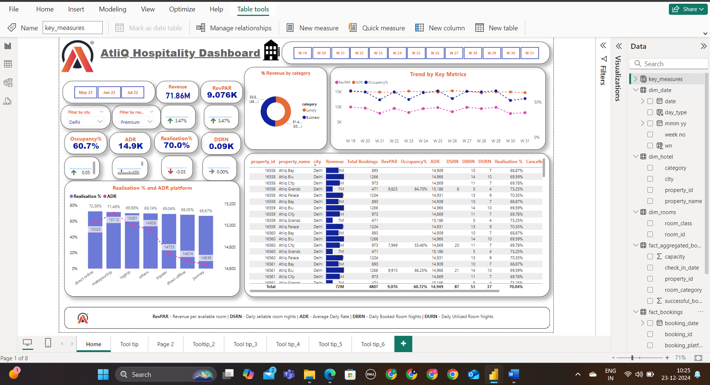

<!--Section 1: Introduce your self-->
## ABOUT ME

Hello! I'm Gopi Raju Kattebina 🤓, a Data Analyst with a passion for turning data into actionable insights. I help businesses solve challenges and unlock growth.

<!--Mention your top/relevant skills here - core and soft skills-->
## SKILLS

*As the Analyst of Global Logic Technologies Pvt Ltd, As a data analyst, I specialize in collecting, cleaning, analyzing, and visualizing data to provide actionable insights and support strategic decision-making.*
*I provide in-depth analysis and tailored solutions to help you make data-driven decisions, optimize processes, and drive business growth.*

**- ✅ Data cleaning and Transformation.**

**- ✅ Data modeling and Data Visualization.**

<!--Section 2: List 3-4 key projects-->
## MY PERSONAL PROJECTS 

*A glimpse of some of the projects I've been working on.*

**Revenue Hospital Data Analysis using the AtliQ Hospital Data set**

[Read More]([https://www.linkedin.com/pulse/predictive-modeling-hypothesis-testing-using-titanic-dataset-anietie/])

**Predictive Modeling and Hypothesis Testing using Titanic Dataset.**

On April 15, 1912, during her maiden voyage, the widely considered “unsinkable” RMS Titanic sank after colliding with an iceberg. 

[Read More](https://www.linkedin.com/pulse/predictive-modeling-hypothesis-testing-using-titanic-dataset-anietie/)

**Predictive Modeling and Hypothesis Testing using Titanic Dataset.**

Unfortunately, there weren’t enough lifeboats for everyone onboard, resulting in the death of 1502 out of 2224 passengers and crew. 

<a href="17 How to Present Data to Executives by Anietie Etuk.pdf">Download the Report here (pdf file)</a>

## CONTACT DETAILS

*Let’s connect and see how we can make a difference together!*
<table>
  <tbody>
    <tr>
      <td>📧</td>
      <td><a href="mailto:katteboinagopi2001@gmail.com">katteboinagopi2001@gmail.com</a></td>
    </tr>
    <tr>
      <td>📞</td>
      <td>(+91) 9346253362</td>
    </tr>
    <tr>
      <td>📍</td>
      <td>INDIA, Andra Pradhesh</td>
    </tr>
    <tr>
      <td>⬇️</td>
      <td><a href="Gopik_resume.docx">Download my CV</a></td>
    </tr>
    <tr>
      <td>🌐</td>
      <td><a href="https://www.linkedin.com/in/gopi-raju-katteboina-410420222/">The things I do daily on LinkedIn</a></td>
    </tr>
  </tbody>
</table>

   
